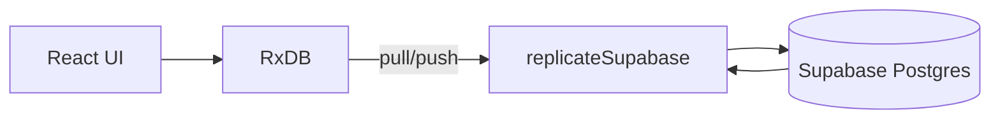
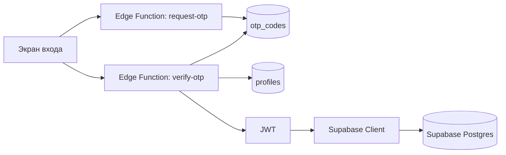

# Архитектура

## Обзор
Приложение построено как offline‑first PWA. Все действия сначала записываются в локальную базу (RxDB + IndexedDB), затем синхронизируются в Supabase. Если сеть недоступна, приложение остается полностью работоспособным локально.

## Основные компоненты
- UI: React + Vite.
- Локальная БД: RxDB поверх IndexedDB (Dexie).
- Синхронизация: `replicateSupabase` для `books`, `requests`, `profiles`.
- Бэкенд: Supabase Postgres + RLS.
- Аутентификация: кастомный OTP через Edge Functions.

## Потоки данных

### Данные книг и запросов

### Аутентификация

## Offline‑first поведение
- Все изменения происходят в RxDB, UI обновляется оптимистично.
- Репликация включается только при доступном Supabase.
- В демо‑режиме синхронизация отключена.

## Обработка ошибок
- На уровне загрузки приложения есть глобальный обработчик ошибок и экран Hard Reset.
- В `db.ts` предусмотрен fallback на in‑memory хранилище, если IndexedDB недоступна.

## Модель данных
- `books`: книга, владелец, статус.
- `requests`: запрос на выдачу, статусы согласования.
- `profiles`: пользовательский профиль.

## Ключевые файлы
- `App.tsx` — маршруты, демо‑режим, инициализация и авторизация.
- `db.ts` — схемы RxDB и репликация.
- `lib/supabaseClient.ts` — инициализация Supabase и хранение токена.
- `lib/storage.ts` — загрузка изображений в Supabase Storage.
- `supabase/functions/*` — Edge Functions OTP.
